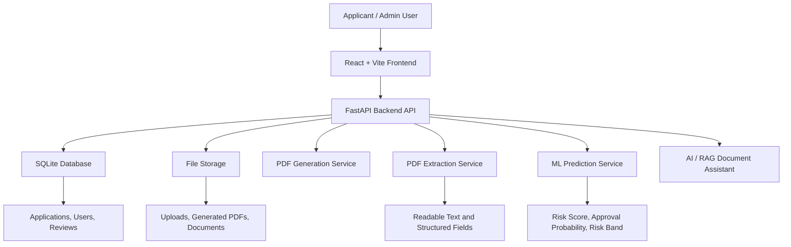
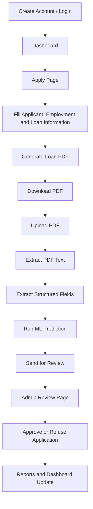
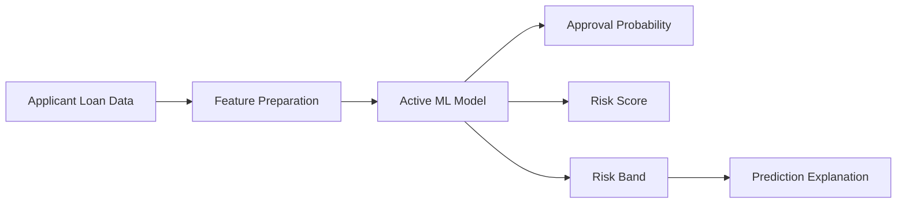
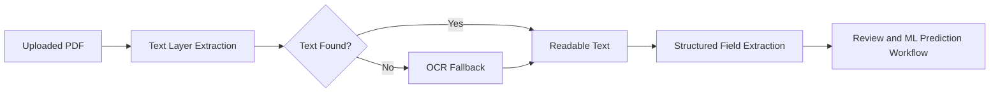

# SmartLoan AI

<div align="center">

## AI-Powered Loan Application, PDF Intelligence, Review Workflow & Risk Prediction Platform

SmartLoan AI is a professional full-stack AI/ML portfolio project that demonstrates a complete digital loan-processing system with loan application management, PDF generation, document extraction, machine learning prediction, admin review workflow, reporting, AI document assistance, and Docker-based deployment.

[]()
[]()
[]()
[]()
[]()
[]()
[]()

</div>

---

## Repository

**GitHub:** https://github.com/tankim-prio/smartloan-ai

---

## Table of Contents

* [Project Overview](#project-overview)
* [Project Objective](#project-objective)
* [Why This Project Matters](#why-this-project-matters)
* [Core Features](#core-features)
* [Technology Stack](#technology-stack)
* [System Architecture](#system-architecture)
* [Main Application Workflow](#main-application-workflow)
* [Machine Learning Workflow](#machine-learning-workflow)
* [PDF Intelligence Workflow](#pdf-intelligence-workflow)
* [Important Pages](#important-pages)
* [Project Structure](#project-structure)
* [Local Development Setup](#local-development-setup)
* [Docker Setup](#docker-setup)
* [Health Check URLs](#health-check-urls)
* [API Areas](#api-areas)
* [Docker Persistence Design](#docker-persistence-design)
* [Screenshots](#screenshots)
* [Demo Video Flow](#demo-video-flow)
* [Recruiter and Professor Review Notes](#recruiter-and-professor-review-notes)
* [Future Improvements](#future-improvements)
* [Author](#author)
* [Project Status](#project-status)

---

## Project Overview

**SmartLoan AI** is a realistic loan application processing platform designed to demonstrate practical software engineering, applied AI/ML integration, document intelligence, and end-to-end workflow automation.

The system allows an applicant to create a loan application, generate a loan PDF, upload documents, extract information from PDFs, run machine learning based loan risk prediction, send the application for review, and allow an admin or reviewer to approve or refuse the application.

This project connects multiple real-world software components into one complete workflow:

* Frontend application
* Backend REST API
* Database-backed loan workflow
* PDF generation
* PDF text extraction
* OCR-based document processing
* Machine learning prediction
* Admin review system
* Dashboard and reports
* AI/RAG-style document assistant
* Dockerized deployment

---

## Project Objective

The main objective of SmartLoan AI is to simulate a real-world digital loan processing platform where user data, financial documents, machine learning prediction, document extraction, and human review are connected in one professional system.

This project is suitable for:

* International job recruiter review
* University project evaluation
* AI Engineer portfolio
* Machine Learning Engineer portfolio
* Backend Developer portfolio
* Full-stack Developer portfolio
* Document intelligence project showcase
* Dockerized application demonstration
* Real-world workflow automation demonstration

---

## Why This Project Matters

SmartLoan AI is not a simple CRUD application. It demonstrates how a modern fintech-style system can combine:

* User input
* Document generation
* Document upload
* Text extraction
* Structured data extraction
* Machine learning prediction
* Human review
* Administrative decision-making
* Reporting
* Docker deployment

Because of this, the project can be reviewed as:

* An **AI Engineering** project
* A **Machine Learning Engineering** project
* A **Backend Engineering** project
* A **Full-Stack Development** project
* A **Document Intelligence** project
* A **Workflow Automation** project

---

## Core Features

### Authentication & User Workflow

* Login page
* Create account page
* User profile page
* Protected application pages
* Applicant workflow
* Admin/reviewer workflow concept
* Clean navigation between system modules

### Loan Application Management

* Professional Apply page
* Personal information section
* Employment and income information section
* Loan information section
* Clean form input workflow
* Application data saving
* Dynamic loan application process
* Professional blank form fields instead of hardcoded sample data

### PDF Generation

* Generate loan application PDF
* Include applicant summary
* Include applicant details
* Support profile photo and document pages
* Support salary certificate, NID, passport, or related supporting documents
* Download generated PDF
* Use generated PDF as part of the loan submission workflow

### PDF Upload & Document Extraction

* Upload generated or external loan PDF
* Extract readable text from PDF
* Extract structured applicant information
* Extract salary certificate information
* Support text-based PDF extraction
* Support OCR fallback for scanned or image-based PDF pages
* Designed for practical document intelligence workflow

Example extracted information may include:

* Application ID
* Applicant name
* Father name
* Mother name
* Age
* Phone number
* Email
* Address
* Occupation
* Monthly income
* Salary certificate number
* Employee name
* Designation
* Monthly salary
* NID or scanned document text when OCR is possible

### Review Management System

* Send loan application for review
* Create review record
* Pending review list
* Approved review list
* Refused review list
* All review history
* Admin can inspect applicant details
* Admin can review extracted document information
* Admin can approve or refuse loan application
* Clean card-based review interface

### Machine Learning Risk Prediction

* Loan approval probability
* Risk score
* Risk band
* Prediction explanation
* Active model concept
* ML Model page
* Model serving workflow
* Prediction connected with Apply page

### Dashboard & Reports

* Dashboard overview
* Application statistics
* Review status summary
* Report page
* Management-level insights
* Portfolio-ready admin interface

### AI Pilot / RAG Assistant

* AI document assistant concept
* Store document text
* Ask questions from stored documents
* Useful for loan policy explanation
* Demonstrates retrieval-style AI workflow
* Shows how AI can support financial document understanding

### Docker Deployment

* Dockerized backend
* Dockerized frontend
* Docker Compose setup
* Nginx frontend container
* FastAPI backend container
* Persistent database mapping
* Persistent upload and storage folders
* Large PDF/image upload support

---

## Technology Stack

| Layer                  | Technologies                                                       |
| ---------------------- | ------------------------------------------------------------------ |
| Frontend               | React, Vite, TypeScript, Tailwind CSS, Shadcn-style UI             |
| Backend                | Python, FastAPI, Uvicorn, Pydantic, SQLAlchemy                     |
| Database               | SQLite                                                             |
| Machine Learning       | scikit-learn, pandas, NumPy, joblib                                |
| PDF Processing         | pypdf / PyPDF, PyMuPDF, ReportLab                                  |
| OCR / Image Processing | pytesseract, Pillow                                                |
| AI Assistant           | RAG-style document assistant workflow                              |
| DevOps                 | Docker, Docker Compose, Nginx                                      |
| Storage                | Local file storage, uploads, generated PDFs, Docker volume mapping |

---

## System Architecture



---

## Main Application Workflow



---

## Machine Learning Workflow



The machine learning module is designed to demonstrate practical model serving inside a business workflow. The ML output helps a reviewer understand the possible risk level of a loan application.

---

## PDF Intelligence Workflow



This workflow is important because real loan documents often contain:

* Text-based PDFs
* Scanned documents
* Salary certificates
* NID or passport images
* Applicant photo pages
* Uploaded supporting documents

---

## Important Pages

| Page           | Purpose                                                  |
| -------------- | -------------------------------------------------------- |
| Login          | User authentication                                      |
| Create Account | Customer account creation                                |
| Dashboard      | System overview and summary                              |
| Apply          | Loan application, PDF upload, extraction, and prediction |
| Review         | Admin approval/refusal workflow                          |
| ML Model       | Model workflow and active model concept                  |
| Reports        | Application and review analytics                         |
| AI Pilot       | AI/RAG document assistant                                |
| Profile        | User profile information                                 |

---

## Project Structure

```text
smartloan-ai/
│
├── backend/
│   ├── app/
│   │   ├── core/
│   │   ├── ml/
│   │   ├── models/
│   │   ├── routers/
│   │   ├── schemas/
│   │   ├── services/
│   │   └── main.py
│   │
│   ├── storage/
│   ├── uploads/
│   ├── data/
│   ├── Dockerfile
│   └── requirements.txt
│
├── frontend/
│   ├── src/
│   ├── public/
│   ├── Dockerfile
│   └── nginx.conf
│
├── docs/
│   ├── SCREENSHOT_LIST.md
│   ├── DEMO_VIDEO_SCRIPT.md
│   └── GITHUB_PUSH_CHECKLIST.md
│
├── docker-compose.yml
├── README.md
└── .gitignore
```

---

## Local Development Setup

### Backend

```powershell
cd backend
python -m venv .venv
.\.venv\Scripts\Activate.ps1
pip install -r requirements.txt
python -m uvicorn app.main:app --reload --host 127.0.0.1 --port 20000
```

Backend URL:

```text
http://localhost:20000
```

### Frontend

```powershell
cd frontend
npm install
npm run dev -- --host localhost --port 5173
```

Frontend URL:

```text
http://localhost:5173
```

---

## Docker Setup

Run the full project from the root directory:

```powershell
docker compose up --build
```

Frontend:

```text
http://localhost:5173
```

Backend:

```text
http://localhost:20000
```

Stop Docker:

```powershell
docker compose down
```

---

## Health Check URLs

```text
http://localhost:20000/api/v1/customer-portal/health
http://localhost:20000/api/v1/ml/health
http://localhost:20000/api/v1/ai-rag/health
```

---

## API Areas

The backend is organized into modular API areas:

* Authentication API
* Customer Portal API
* Loan Application API
* PDF Generation API
* PDF Extraction API
* Review Workflow API
* ML Prediction API
* AI/RAG Assistant API
* Dashboard and Reports API

---

## Docker Persistence Design

The Docker version is designed to preserve important local data by using volume mapping.

Persistent areas include:

* SQLite database files
* Uploaded PDFs
* Generated PDFs
* Document uploads
* Storage folders
* Application records
* Review records

This helps the Docker workflow behave closer to the local development workflow instead of starting from an empty container every time.

---

## Screenshots

Recommended screenshot folder:

```text
docs/screenshots/
```

Recommended screenshots for portfolio presentation:

| Screenshot     | Purpose                |
| -------------- | ---------------------- |
| Login Page     | Authentication UI      |
| Dashboard      | System overview        |
| Apply Page     | Main loan workflow     |
| PDF Generation | Document automation    |
| PDF Extraction | Document intelligence  |
| ML Prediction  | AI/ML decision support |
| Review Page    | Admin workflow         |
| Reports Page   | Analytics and summary  |
| ML Model Page  | Model workflow         |
| AI Pilot Page  | AI assistant           |
| Docker Running | Deployment proof       |

---

## Demo Video Flow

A professional demo video can follow this order:

1. Introduce SmartLoan AI.
2. Show login page.
3. Open dashboard.
4. Open Apply page.
5. Show applicant information form.
6. Generate loan PDF.
7. Upload loan PDF.
8. Extract PDF text.
9. Extract structured fields.
10. Run ML prediction.
11. Send application for review.
12. Open Review page.
13. Approve or refuse application.
14. Open Reports page.
15. Open ML Model page.
16. Open AI Pilot page.
17. Show Docker running.
18. End with GitHub repository.

---

## Recruiter and Professor Review Notes

SmartLoan AI demonstrates strong practical engineering ability because it connects multiple real-world software modules into one complete system.

The project shows experience in:

* Full-stack application design
* Backend API development
* Frontend workflow implementation
* Database-backed systems
* PDF generation
* PDF extraction
* OCR document processing
* Machine learning integration
* Review and approval workflow
* Dashboard and reporting
* AI/RAG assistant concept
* Docker deployment
* Professional documentation

This makes the project suitable for international recruiter review, university project evaluation, and technical interview discussion.

---

## Future Improvements

Possible future improvements include:

* PostgreSQL production database
* JWT refresh token system
* Advanced Bangla OCR support
* Cloud deployment
* CI/CD with GitHub Actions
* Audit log system
* Email notification system
* Model monitoring dashboard
* Vector database based RAG
* Role-specific dashboards
* Real banking or fintech API integration
* Production-grade authentication and authorization

---

## Author

**Tankim Prio**

GitHub:

```text
https://github.com/tankim-prio
```

Repository:

```text
https://github.com/tankim-prio/smartloan-ai
```

---

## Project Status

SmartLoan AI is a completed portfolio project with:

* Working frontend
* Working backend
* Working Docker setup
* Loan application workflow
* PDF generation
* PDF extraction
* Review workflow
* ML prediction
* Dashboard and reports
* AI Pilot / RAG assistant
* Professional GitHub documentation

---

<div align="center">

**SmartLoan AI — Practical AI, ML, Backend and Full-Stack Engineering in One Complete Project**

</div>
