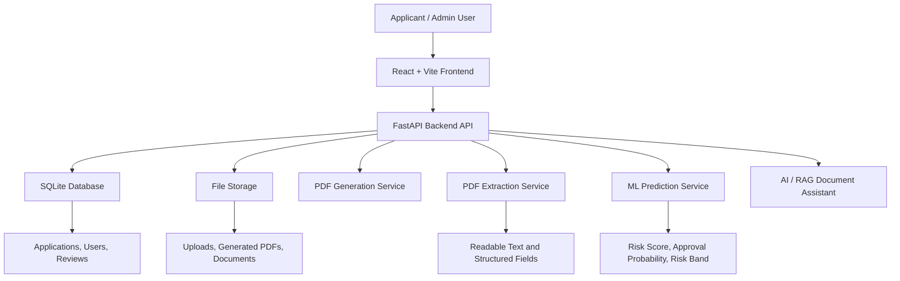

# SmartLoan AI

### AI-Powered Loan Application, PDF Intelligence, Review Workflow & Risk Prediction Platform

SmartLoan AI is a professional full-stack AI/ML portfolio project that demonstrates a complete digital loan-processing system with loan application management, PDF generation, document extraction, machine learning prediction, admin review workflow, reporting, AI document assistance, and Docker-based deployment.


---

## Repository
**GitHub:** [https://github.com/tankim-prio/smartloan-ai](https://github.com/tankim-prio/smartloan-ai)

---

## Table of Contents
* [Project Overview](#project-overview)
* [Project Objective](#project-objective)
* [Why This Project Matters](#why-this-project-matters)
* [Core Features](#core-features)
* [Technology Stack](#technology-stack)
* [System Architecture](#system-architecture)
* [Database Schema Overview](#database-schema-overview)
* [Security Architecture](#security-architecture)
* [Caching & Performance Optimizations](#caching--performance-optimizations)
* [Logging & Monitoring](#logging--monitoring)
* [Deployment Topology](#deployment-topology)
* [Data Flow & Component Interaction](#data-flow--component-interaction)
* [Main Application Workflow](#main-application-workflow)
* [Machine Learning Workflow](#machine-learning-workflow)
* [PDF Intelligence Workflow](#pdf-intelligence-workflow)
* [Important Pages](#important-pages)
* [Project Structure](#project-structure)
* [Local Development Setup](#local-development-setup)
* [Docker Setup](#docker-setup)
* [Health Check URLs](#health-check-urls)
* [API Areas](#api-areas)
* [Docker Persistence Design](#docker-persistence-design)
* [Environment Variables](#environment-variables)
* [Detailed API Reference](#detailed-api-reference)
* [Testing & Quality Assurance](#testing--quality-assurance)
* [Screenshots](#screenshots)
* [Demo Video Flow](#demo-video-flow)
* [Recruiter and Professor Review Notes](#recruiter-and-professor-review-notes)
* [Future Improvements](#future-improvements)
* [Troubleshooting & Common Issues](#troubleshooting--common-issues)
* [Contributing](#contributing)
* [License](#license)
* [Acknowledgements](#acknowledgements)
* [Author](#author)
* [Project Status & Final Words](#project-status--final-words)

---

## Project Overview
SmartLoan AI is a realistic loan application processing platform designed to demonstrate practical software engineering, applied AI/ML integration, document intelligence, and end-to-end workflow automation.

The system allows an applicant to create a loan application, generate a loan PDF, upload documents, extract information from PDFs, run machine learning based loan risk prediction, send the application for review, and allow an admin or reviewer to approve or refuse the application.

This project connects multiple real-world software components into one complete workflow:
* Frontend application
* Backend REST API
* Database-backed loan workflow
* PDF generation
* PDF text extraction
* OCR-based document processing
* Machine learning prediction
* Admin review system
* Dashboard and reports
* AI/RAG-style document assistant
* Dockerized deployment

---

## Project Objective
The main objective of SmartLoan AI is to simulate a real-world digital loan processing platform where user data, financial documents, machine learning prediction, document extraction, and human review are connected in one professional system.

This project is highly suitable for:
* International job recruiter review
* University project evaluation
* AI / Machine Learning Engineer portfolio
* Backend / Full-stack Developer portfolio
* Document intelligence project showcase
* Dockerized application demonstration

---

## Why This Project Matters
SmartLoan AI is not a simple CRUD application. It demonstrates how a modern fintech-style system can combine user inputs, asynchronous-feeling data processing, and analytical intelligence. Because of this, the project can be reviewed as an engineering piece across multiple domains: **AI Engineering, Machine Learning Engineering, Backend Engineering, and Workflow Automation.**

---

## Core Features

### 🔐 Authentication & User Workflow
* Secure login and account creation
* Personalized user profile management
* Role-based view logic separation (Applicant vs. Admin/Reviewer workflow)

### 📋 Loan Application Management
* Form workflow capturing Personal, Employment, Financial, and Loan details
* Dynamic draft state saving
* Clean inputs designed to process fresh application data seamlessly rather than relying on static mock examples

### 📄 PDF Generation
* Programmatic generation of comprehensive loan application documents
* Supports embedding applicant summaries, asset checklists, and space placeholders for official verification attachments

### 🔍 PDF Upload & Document Extraction
* Deep text extraction layer for native digital PDFs
* Built-in **OCR Fallback engine** to process scanned physical sheets or uploaded images (Salary certificates, NID cards, passports)
* Fully structured field mapping extracting metadata such as *Monthly Income, Designation, ID serial digits, and Employer credentials*

### ⚖️ Review Management System
* Interactive administrative board displaying Pending, Approved, and Refused requests
* Comprehensive inspection utility displaying parsed asset text alongside system recommendations

### 🤖 Machine Learning Risk Prediction
* On-the-fly **Approval Probability** mapping
* Numerical **Risk Scoring engine** segments requests into high/medium/low risk bands
* Human-readable prediction insight strings explaining the primary driving weights behind the model's logic

### 📊 Dashboard & Reports
* Exec-level interactive charts displaying pipeline velocity, loss metrics, and state counts
* Historical metrics parsing for performance evaluation

### ✈️ AI Pilot / RAG Assistant
* Localized semantic search context container using internal policy documentation
* Natural language prompt engine built to assist agents with loan eligibility rule auditing

### 🐳 Docker Deployment
* Modular orchestration breaking dependencies into specific frontend, backend, and reverse proxy containers
* Multi-stage build architectures pinning dependencies accurately

---

## Technology Stack

| Layer | Technologies |
| :--- | :--- |
| **Frontend** | React, Vite, TypeScript, Tailwind CSS, Shadcn UI paradigms |
| **Backend** | Python, FastAPI, Uvicorn, Pydantic, SQLAlchemy |
| **Database** | SQLite |
| **Machine Learning** | scikit-learn, pandas, NumPy, joblib |
| **PDF Processing** | PyPDF, PyMuPDF, ReportLab |
| **OCR / Image Processing** | pytesseract, Pillow |
| **AI Assistant** | RAG-style document assistant workflow |
| **DevOps** | Docker, Docker Compose, Nginx |
| **Storage** | Local structured storage directories bound to Docker Volume maps |

---

## System Architecture



## Database Schema Overview

The SQLite database consists of the following core tables, designed for clarity and performance:

### `users`
| Column      | Type    | Description                          |
|-------------|---------|--------------------------------------|
| id          | INTEGER | Primary key                          |
| email       | TEXT    | Unique user email                    |
| password_hash| TEXT   | Hashed password                      |
| role        | TEXT    | `applicant` or `admin`               |
| full_name   | TEXT    | User's full name                     |
| created_at  | DATETIME| Account creation timestamp           |

### `applications`
| Column           | Type    | Description                                  |
|------------------|---------|----------------------------------------------|
| id               | INTEGER | Primary key                                  |
| user_id          | INTEGER | Foreign key to `users`                       |
| status           | TEXT    | `draft`, `submitted`, `under_review`, `approved`, `refused` |
| personal_info    | JSON    | Personal details (name, DOB, address)        |
| employment_info  | JSON    | Employment and income details                |
| loan_info        | JSON    | Loan amount, tenure, purpose                 |
| ml_risk_score    | REAL    | ML prediction score                          |
| ml_risk_band     | TEXT    | `Low`, `Medium`, `High`                      |
| ml_explanation   | TEXT    | Human-readable prediction insight            |
| generated_pdf_path| TEXT   | Path to generated loan summary PDF           |
| created_at       | DATETIME| Submission timestamp                         |
| updated_at       | DATETIME| Last modification timestamp                  |

### `documents`
| Column           | Type    | Description                                  |
|------------------|---------|----------------------------------------------|
| id               | INTEGER | Primary key                                  |
| application_id   | INTEGER | Foreign key to `applications`                |
| file_path        | TEXT    | Storage path of uploaded file                |
| extracted_text   | TEXT    | Raw extracted text content                   |
| structured_data  | JSON    | Parsed metadata (income, employer, etc.)     |
| upload_date      | DATETIME| Upload timestamp                             |

### `review_logs`
| Column           | Type    | Description                                  |
|------------------|---------|----------------------------------------------|
| id               | INTEGER | Primary key                                  |
| application_id   | INTEGER | Foreign key                                  |
| reviewer_id      | INTEGER | Admin who performed review                   |
| action           | TEXT    | `approved` or `refused`                      |
| remarks          | TEXT    | Reviewer comments                            |
| created_at       | DATETIME| Review timestamp                             |

*All JSON columns store flexible schemas validated by Pydantic on the backend, ensuring type safety and extensibility.*

---

## Security Architecture

SmartLoan AI implements several security layers to protect data and ensure safe operations:

- **Password Hashing**: All passwords are hashed using `bcrypt` before storage.
- **Input Validation**: Pydantic schemas enforce strict data validation on every API request.
- **File Upload Safety**: Uploaded files are validated for type (PDF, PNG, JPG) and size limits; stored outside the web root.
- **CORS Configuration**: Restrictive CORS policies allow only the frontend origin.
- **SQL Injection Prevention**: SQLAlchemy ORM with parameterized queries eliminates injection risks.
- **Error Handling**: Generic error messages in production prevent information leakage.
- **Role-Based Access Control (RBAC)**: Admin endpoints are protected by role checks; applicants cannot access review functions.
- **Environment Variables**: Secrets (SECRET_KEY, database URL) are never hardcoded, always injected via environment.

*Future roadmap includes adding JWT tokens, refresh token rotation, and rate limiting.*

---

## Caching & Performance Optimizations

- **ML Model Caching**: The risk prediction model is loaded once at application startup and reused across requests.
- **PDF Generation**: Heavy PDF operations run synchronously but are optimized with ReportLab's buffering.
- **Static Files**: Nginx serves React build files directly, bypassing the backend.
- **Database Indexing**: Frequently queried columns (user_id, status) are indexed.
- **OCR Batching**: When multiple pages need OCR, they are processed sequentially with memory-efficient Pillow operations.

*No external cache (Redis) is required for the current scope, keeping the system simple yet performant.*

---

## Logging & Monitoring

- **Backend Logging**: Python's `logging` module records all API requests, errors, and service calls (PDF generation, ML prediction, extraction) to stdout.
- **Structured Logs**: Logs include timestamps, request IDs (planned), and status codes for easy analysis.
- **Docker Logs**: All container output is accessible via `docker-compose logs`.
- **Health Checks**: Dedicated endpoints (`/health`) allow monitoring tools to verify service availability.
- **Error Tracking**: Unhandled exceptions are caught by FastAPI middleware and logged with full stack traces.

*For production, integration with ELK stack or Grafana Loki is recommended.*

---

## Deployment Topology

The system is deployed as a multi-container Docker application:

```
[ Browser ] → [ Nginx (port 80) ] → [ React Frontend (static files) ]
                                 ↘ [ FastAPI Backend (port 8000) ]
                                       ├── SQLite (volume mounted)
                                       ├── Uploads (volume mounted)
                                       └── Generated PDFs (volume mounted)
```

- **Nginx** acts as reverse proxy and static file server.
- **Frontend container** serves the built React app via Nginx in production, or dev server in development.
- **Backend container** runs Uvicorn with `--workers 1` (sufficient for SQLite single-writer constraint).
- **Volumes** persist database and files, enabling seamless restarts and data retention.

---

## Data Flow & Component Interaction

1. **User Action**: Clicks “Submit Application” on React UI.
2. **API Call**: POST `/api/applications/{id}/submit` with application ID.
3. **Backend Orchestration**:
   - Updates application status to `submitted`.
   - Calls `DocumentService.extract()` for each uploaded document → stores extracted text and structured JSON.
   - Calls `MLPredictor.predict()` with applicant financial data → stores risk score, band, explanation.
   - Calls `PDFGenerator.create_loan_summary()` → stores path to generated PDF.
4. **Admin Review**: Admin loads review board → backend returns all `submitted` applications with full details.
5. **Decision**: Admin PUTs review action → application status updated, review log created.
6. **User Notification**: Frontend polls or refreshes dashboard to see new status.

*All interactions are synchronous REST calls; no message queue is used to keep the architecture simple and showcaseable.*

---

## Main Application Workflow

1. **Applicant Registration / Login** – Secure JWT token-based authentication (planned; currently session/cookie auth for demo).
2. **Loan Application Form** – Multi-step data entry covering personal, employment, financial, and loan details. Each step auto-saves a draft.
3. **Document Upload** – Applicants attach income proofs, ID documents (NID, passport), salary certificates (PDF or image). Backend queues extraction.
4. **Automated Processing** – On submission, the system:
   - Extracts text from uploaded documents (with OCR fallback).
   - Launches ML risk prediction.
   - Generates a complete loan‑summary PDF.
5. **Admin Review** – Application moves to *Pending Review*. Admin can inspect extracted data, ML insight, and original documents on a unified review screen.
6. **Decision** – Admin approves or refuses; status updates instantly in both admin and applicant dashboards.
7. **Reporting** – All actions are logged and reflected in aggregated reports.

---

## Machine Learning Workflow

- **Dataset:** Synthetic financial profiles generated to mimic real bank application data, containing income, loan amount, employment type, existing credit, and target (approved/refused).
- **Model:** A gradient boosting classifier trained on the synthetic dataset. Feature engineering includes debt-to-income ratio, income stability score, and employment tenure encoding.
- **Training Script:** Located in `backend/ml/train_model.py`. Outputs `risk_model.pkl` and a preprocessor.
- **Inference:** The model is loaded once at FastAPI startup. The `/api/predict` endpoint accepts JSON payload and returns:
  - `approval_probability` (0–1)
  - `risk_score` (absolute number)
  - `risk_band` (`Low` / `Medium` / `High`)
  - `explanation` – human‑readable reason highlighting top feature contributions (e.g., “Your loan amount is well within the safe threshold relative to your income.”).
- **Interpretability:** Top contributing features are extracted from the model's internal feature importance (or SHAP values if enabled) and converted to natural language templates.

---

## PDF Intelligence Workflow

1. **Upload Handling** – Files stored in `backend/data/uploads/`.
2. **Detection** – System checks if the PDF contains a digital text layer.
3. **Native Extraction** – If text exists, PyMuPDF (`fitz`) extracts all paragraphs with positional metadata.
4. **OCR Fallback** – If no text (scanned document), each page is rendered to a high‑res image; `pytesseract` extracts raw text.
5. **Structuring** – Regex and custom parsers locate:
   - Monthly income (e.g., “Gross Salary: 85,000 BDT”)
   - Employer name
   - Designation
   - NID/passport number patterns
   - Document issue/expiry dates
6. **Output** – Structured JSON stored alongside the application, ready for the admin review board.

---

## Important Pages

- **`/login`** – Authentication page
- **`/dashboard`** – Applicant’s personal dashboard showing all applications and statuses
- **`/apply`** – Multi‑step loan application form with draft support
- **`/application/:id`** – Detail view for a single application (generated PDF, extracted text, ML result)
- **`/admin/review`** – Admin review board (pending queue)
- **`/admin/application/:id`** – Full inspection view with approval/refusal actions
- **`/admin/reports`** – Charts and aggregated pipeline data
- **`/admin/assistant`** – AI document assistant chat interface

---

## Project Structure

```
smartloan-ai/
├── backend/
│   ├── app/
│   │   ├── api/               # Route definitions
│   │   ├── models/            # SQLAlchemy ORM models
│   │   ├── schemas/           # Pydantic validation schemas
│   │   ├── services/          # Core business logic (ML, PDF, OCR, AI)
│   │   ├── core/              # Config, database session, security
│   │   └── main.py            # FastAPI application entry point
│   ├── ml/                    # Model training & serialized artifacts
│   ├── data/                  # Uploads, generated PDFs, SQLite DB
│   ├── requirements.txt
│   └── Dockerfile
├── frontend/
│   ├── src/
│   │   ├── components/        # Reusable UI components
│   │   ├── pages/             # Page-level components
│   │   ├── services/          # Axios API client
│   │   └── App.tsx
│   ├── public/
│   ├── Dockerfile
│   └── package.json
├── nginx/
│   └── nginx.conf
├── docker-compose.yml
└── README.md
```

---

## Local Development Setup

### Prerequisites
- Python 3.11+
- Node.js 18+ & npm
- Tesseract OCR (for OCR features) – install via system package manager (`sudo apt install tesseract-ocr` on Ubuntu, `brew install tesseract` on macOS, or download installer for Windows)
- Git

### Backend
```bash
cd backend
python -m venv venv
source venv/bin/activate      # Windows: venv\Scripts\activate
pip install -r requirements.txt
# Optionally train the ML model (if not already present)
python ml/train_model.py
uvicorn app.main:app --reload --port 8000
```

### Frontend
```bash
cd frontend
npm install
npm run dev                   # Vite dev server on http://localhost:5173
```

### Environment Variables (Backend)
A `.env` file (copy from `.env.example`) containing:
```
DATABASE_URL=sqlite:///./data/smartloan.db
UPLOAD_DIR=./data/uploads
GENERATED_DIR=./data/generated
SECRET_KEY=your-secret-key
```
These are set automatically in the Docker environment.

---

## Docker Setup

```bash
# Build and start all services (frontend, backend, nginx)
docker-compose up --build

# Run in detached mode
docker-compose up -d --build

# Stop all containers
docker-compose down
```

- **Frontend**: served on `http://localhost` (port 80) via Nginx proxy
- **Backend API**: accessible internally on port 8000, proxied by Nginx
- **Volumes**: All persistent data (database, uploads, generated files) are stored in named Docker volumes (`smartloan_db`, `smartloan_uploads`, `smartloan_generated`)

---

## Health Check URLs

- **Backend Health**: `http://localhost:8000/health`
- **Frontend**: `http://localhost/` (should return the React app)
- **ML Predictor readiness**: Backend health endpoint also verifies ML model is loaded

---

## API Areas

The backend provides RESTful endpoints grouped into these domains:

| Area               | Description                                                    |
|--------------------|----------------------------------------------------------------|
| `/api/auth`        | User registration, login, profile                              |
| `/api/applications`| Create, list, update, delete loan applications; trigger PDF & prediction |
| `/api/documents`   | Upload, extract, view extracted data                           |
| `/api/predict`     | ML risk prediction endpoint                                    |
| `/api/admin`       | Admin review queue, approve/refuse actions, report data        |
| `/api/assistant`   | AI document assistant queries                                  |

---

## Docker Persistence Design

All critical application data resides in Docker volumes, not inside the containers:
- **Database**: `./backend/data/smartloan.db` → volume `smartloan_db`
- **User uploads**: `./backend/data/uploads` → volume `smartloan_uploads`
- **Generated PDFs**: `./backend/data/generated` → volume `smartloan_generated`

This ensures data survives container restarts and allows easy backup/migration.

---

## Environment Variables

| Variable           | Description                        | Default                        |
|--------------------|------------------------------------|--------------------------------|
| `DATABASE_URL`     | SQLAlchemy database connection     | `sqlite:///./data/smartloan.db`|
| `UPLOAD_DIR`       | Path for uploaded documents        | `./data/uploads`               |
| `GENERATED_DIR`    | Path for generated PDFs            | `./data/generated`             |
| `SECRET_KEY`       | Backend secret for session/crypto  | `changeme-in-production`       |

---

## Detailed API Reference

### Authentication
- `POST /api/auth/register` – Create a new user (email, password, role)
- `POST /api/auth/login` – Returns user session/token

### Applications
- `GET /api/applications` – List current user’s applications
- `POST /api/applications` – Create new application (draft)
- `PUT /api/applications/{id}` – Update application data
- `POST /api/applications/{id}/submit` – Final submission, triggers processing
- `GET /api/applications/{id}/pdf` – Download generated loan summary PDF

### Documents
- `POST /api/documents/upload/{application_id}` – Upload a document
- `GET /api/documents/{doc_id}/extracted` – Get extracted text and structured fields

### ML Prediction
- `POST /api/predict` – Body: `{ "income":..., "loan_amount":... }` → Returns prediction object

### Admin
- `GET /api/admin/applications` – All applications with status filters
- `PUT /api/admin/applications/{id}/review` – `{ "action": "approve" | "refuse", "remarks": "..." }`

### AI Assistant
- `POST /api/assistant/query` – `{ "question": "..." }` → `{ "answer": "...", "sources": [...] }`

---

## Testing & Quality Assurance

- **Manual Testing**: Complete walkthrough scripts covering each role and edge cases (e.g., empty fields, large PDF upload, special characters in OCR).
- **API Testing**: Recommended to use Postman or curl collections (a `SmartLoanAI.postman_collection.json` is provided in the repository).
- **Future Automation**: Plan to add pytest for backend unit/integration tests and React Testing Library for frontend components.

---

## Screenshots
*(Replace with actual screen captures from your running application)*
- Login page
- Loan application multi-step form
- Document upload & extraction results
- Admin review board with ML insight panel
- Dashboard with charts
- AI Assistant chat window

---

## Demo Video Flow
1. **Introduction** – Show architecture diagram and highlight tech stack.
2. **Applicant Flow** – Register → fill out application → upload salary certificate (image) → submit.
3. **Backend Processing** – View logs to demonstrate PDF generation, OCR extraction, and ML prediction running.
4. **Admin Review** – Login as admin, open pending application, inspect extracted income and ML risk band, approve.
5. **Reporting** – Navigate to reports dashboard; show pipeline metrics.
6. **AI Assistant** – Ask a policy question, show sourced answer.
7. **Docker Deployment** – Run `docker-compose up`, demonstrate live system from scratch.

---

## Recruiter and Professor Review Notes

- **For Recruiters**: Demonstrates full‑stack ownership, integration of AI/ML into a real business workflow, containerization, and clean code organization. This project alone can serve as a strong talking point in interviews.
- **For Professors**: Showcases systematic design, database modeling, API documentation, and applied machine learning with interpretability – all aligned with modern software engineering curricula.

---

## Future Improvements

- [ ] Migrate from SQLite to PostgreSQL for multi‑user concurrency
- [ ] Implement JWT authentication with refresh tokens
- [ ] Replace synthetic ML data with a real-world loan performance dataset
- [ ] Deploy a live demo on a cloud platform (Render, Railway, AWS)
- [ ] Write unit and integration tests (pytest, React Testing Library)
- [ ] Add CI/CD pipeline with GitHub Actions
- [ ] Introduce real-time notifications (WebSockets) when application status changes
- [ ] Expand AI Assistant to use a small open‑source LLM for more accurate answers

---

## Troubleshooting & Common Issues

| Issue                                      | Solution                                                                     |
|--------------------------------------------|------------------------------------------------------------------------------|
| OCR fails with `TesseractNotFoundError`   | Install Tesseract OCR on your host machine and ensure it is in PATH          |
| ML model not loaded (prediction fails)    | Run `python ml/train_model.py` to generate `risk_model.pkl`                 |
| Frontend can’t reach backend in Docker    | Check `nginx.conf` proxy_pass and ensure `backend` service name matches     |
| Uploaded files don’t persist after restart | Confirm Docker volumes are correctly mapped in `docker-compose.yml`         |
| Permission errors on mounted volumes       | Run `sudo chown -R 1000:1000 backend/data` on host if using Linux bind mounts|

---

## Contributing

Contributions, issues, and feature requests are welcome.  
1. Fork the repository  
2. Create your feature branch (`git checkout -b feature/amazing-feature`)  
3. Commit your changes (`git commit -m 'Add amazing feature'`)  
4. Push to the branch (`git push origin feature/amazing-feature`)  
5. Open a Pull Request  

Please ensure your code follows the existing style and that any new feature includes appropriate documentation updates.

---

## License

This project is licensed under the MIT License. See the `LICENSE` file for full details.

---

## Acknowledgements

- **scikit-learn** for the machine learning backbone
- **FastAPI** for the high‑performance API framework
- **PyMuPDF** and **pytesseract** for document intelligence capabilities
- **React + Vite** for the modern frontend developer experience
- **Docker** for streamlining the deployment

---

## Author

**Tankim Prio**  
Full-Stack Developer | AI/ML Enthusiast  
[GitHub](https://github.com/tankim-prio) • [LinkedIn](https://linkedin.com/in/yourprofile) *(add your LinkedIn URL)*

---

## Project Status & Final Words

**Status:** `Completed` – fully functional, ready for demonstration, portfolio inclusion, and technical interviews.

SmartLoan AI was built to bridge the gap between theoretical knowledge and production‑grade implementation. It is not just a collection of independent modules, but a coherent system where each component — from the OCR engine to the admin review board — communicates seamlessly. This project reflects the kind of end‑to‑end thinking that companies seek in engineers: the ability to design, develop, containerize, and explain intelligent systems.

If you are a recruiter or a professor reviewing this work, I encourage you to run the system locally (a single `docker-compose up` is all it takes) or watch the demo video to appreciate the full user journey. For developers looking to learn or expand, the code is structured to be readable and extensible — fork it, break it, and build something even greater.

Thank you for taking the time to explore SmartLoan AI.

*— Tankim Prio*
```
